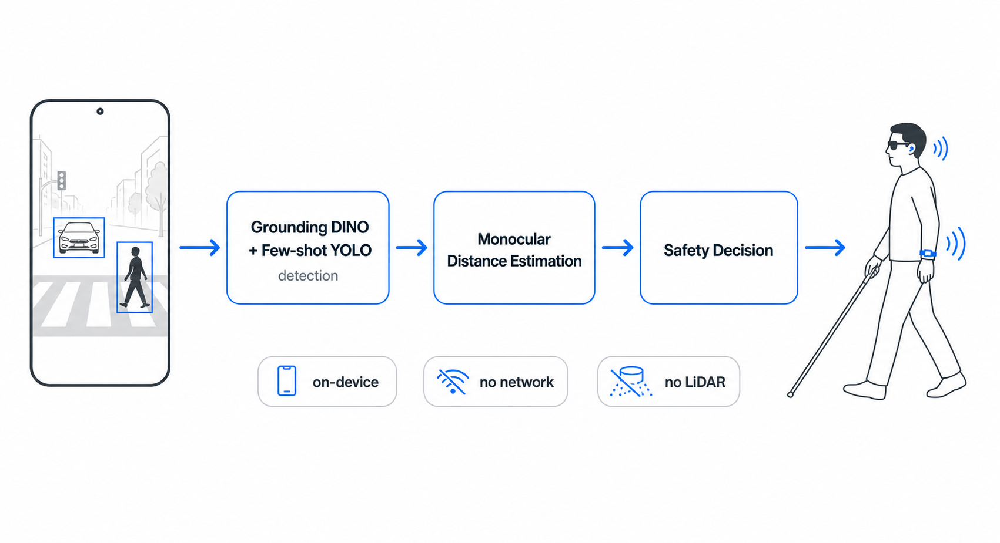

<h1 align="center">Blind CrossWalk</h1>

<p align="center">
  <b>On-device pedestrian-crossing assistance for the visually impaired.</b><br />
  Single-camera, monocular-distance, few-shot-trained safety system.
</p>

<p align="center">
  <i>KIIT Gold Prize · KCI First-Author Publication · Field Tested · 2024</i><br />
  <i>Global Korea Co., Ltd. × Andong National University</i>
</p>

<p align="center">
  <a href="https://www.dbpia.co.kr/author/authorDetail?ancId=5421843">
    <b>→ All publications on DBpia</b>
  </a>
</p>

---

## Why

A white cane tells you the curb is there. It does not tell you the truck is.

Existing aids — voice signals, canes, guide dogs — answer *"is there a crosswalk?"* but not *"is a vehicle coming, and how close?"* That gap kills people.

We asked: *can a single phone camera, fully on-device, close it?*

## What

A pedestrian-crossing safety pipeline that, from one front-facing camera, **detects** crosswalk + signal + approaching vehicle, **estimates monocular distance** to that vehicle, and **adapts to new intersection layouts** with a handful of examples — using **few-shot learning + Grounding DINO + YOLO**. No LiDAR. No stereo rig. No network.

## Architecture

<p align="center">
  
</p>

The pipeline integrates three model families:

| Stage | Model | Role |
|-------|-------|------|
| Open-vocabulary localization | **Grounding DINO** | Localize crosswalk, signal, and vehicle regions even on unseen intersection layouts |
| Few-shot detection | **Few-shot YOLO** | Adapt to new scenes with minimal labeled samples |
| Distance estimation | **Monocular geometry** | Estimate vehicle distance from a single camera, no stereo needed |
| Output | **Safety signal** | Audible / haptic warning to the user |

## Stack

[](https://skillicons.dev)

| Layer | Technology |
|-------|-----------|
| Object detection | YOLO (Few-shot fine-tuned) |
| Open-vocabulary | Grounding DINO |
| Vision pipeline | OpenCV + PyTorch |
| Monocular distance | Camera-intrinsic calibration + perspective geometry |
| Deployment | On-device inference (no server, no network) |

## Results

- **First-author KCI-indexed publication** — *Semi-supervised YOLO framework with Few-shot Learning and Grounding DINO for visually impaired pedestrian safety*, KIIT Transactions, 2024.
- **KIIT Gold Prize** (2024).
- Field-tested on real pedestrian-crossing scenarios in Andong, South Korea.
- Industry collaboration: **Global Korea Co., Ltd.** (Andong) + Andong National University.

## Publications

- [DBpia · all author publications](https://www.dbpia.co.kr/author/authorDetail?ancId=5421843)
- KCI 등재 — *Semi-supervised YOLO framework with Few-shot Learning and Grounding DINO for visually impaired pedestrian safety* (KIIT Transactions, 2024, first author)

## Repo Layout

```
Blind_crossWalk/
├── pedestrian traffic light/   # signal-detection notebooks + experiments
├── Intersection/               # full crosswalk-region pipeline
└── README.md
```

## Author

Somi Jeong — first author, AI modeling lead.  
Contact: [LinkedIn](https://www.linkedin.com/in/someee) · [GitHub](https://github.com/1wos)

---

<p align="center">
  <i>This work was conducted as part of an industry-academic collaboration with Global Korea Co., Ltd. (Andong).</i>
</p>
